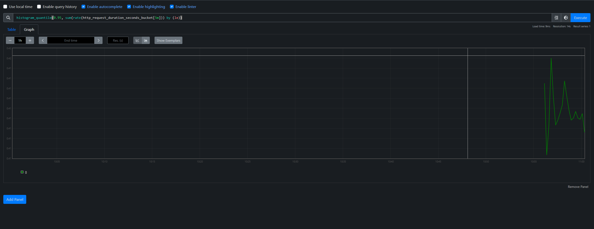
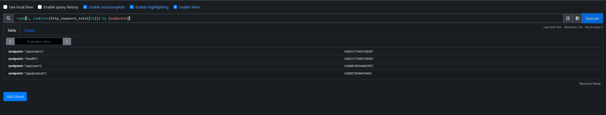
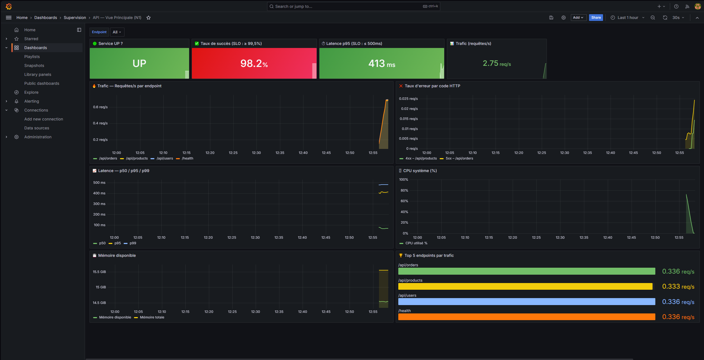
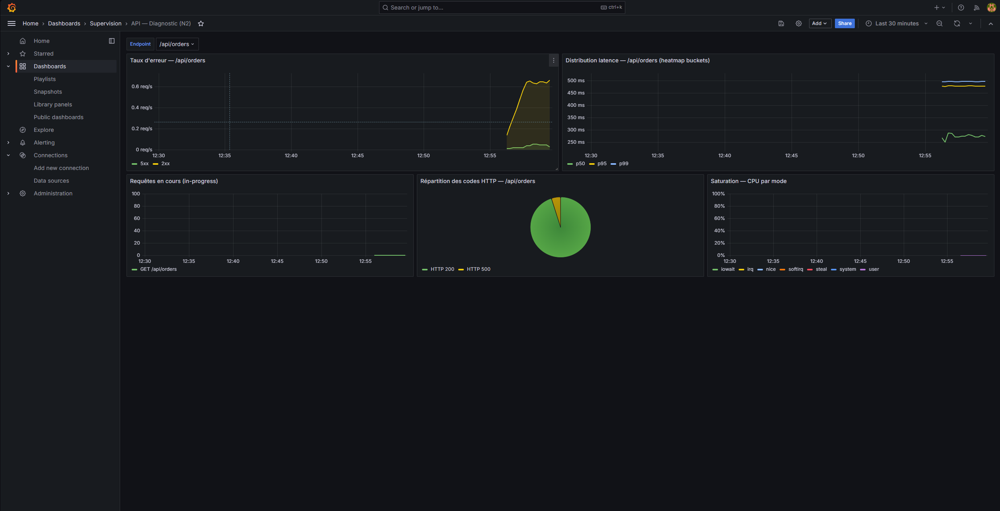

# Supervision Production — Prometheus + Grafana

Stack de supervision opérationnelle déployée via Docker Compose, couvrant une API web instrumentée et son environnement système.

---

## Lancer / Arrêter la stack

```bash
# Démarrer tous les services
docker compose up -d --build

# Vérifier que tout est UP
docker compose ps

# Arrêter la stack (conservation des données)
docker compose down

# Arrêter ET supprimer les volumes (reset complet)
docker compose down -v
```

### Accès aux interfaces

| Service       | URL                          | Identifiants     |
|---------------|------------------------------|------------------|
| API FastAPI   | http://localhost:8000        | —                |
| Prometheus    | http://localhost:9090        | —                |
| Grafana       | http://localhost:3000        | admin / admin    |
| Alertmanager  | http://localhost:9093        | —                |

> Les dashboards Grafana sont chargés automatiquement via provisioning.

---

## Architecture

```
┌─────────────────┐     /metrics     ┌──────────────┐
│  FastAPI App    │ ◄──────────────  │  Prometheus  │──► Grafana
│  (demo-api)     │                  │              │
└─────────────────┘                  │              │──► Alertmanager
┌─────────────────┐     /metrics     │              │
│  node_exporter  │ ◄──────────────  └──────────────┘
│  (CPU/RAM/FS)   │
└─────────────────┘
┌─────────────────┐
│traffic-generator│ ──► génère du trafic HTTP continu pour simuler la charge
└─────────────────┘
```

---

## Métriques utilisées et justification

### Métriques applicatives (FastAPI)

| Métrique | Type | Pourquoi |
|---|---|---|
| `http_requests_total` | Counter | Trafic, taux d'erreur par code HTTP |
| `http_request_duration_seconds` | Histogram | Latence p50/p95/p99 (buckets fin-grained) |
| `http_requests_in_progress` | Gauge | Détection de saturation applicative |
| `app_info` | Gauge | Identification version/env en cours d'exécution |

### Métriques système (node_exporter)

| Métrique | Pourquoi |
|---|---|
| `node_cpu_seconds_total` | Saturation CPU (par mode : idle, user, system, iowait) |
| `node_memory_MemAvailable_bytes` | Mémoire réellement disponible (plus fiable que MemFree) |
| `node_memory_MemTotal_bytes` | Mémoire totale pour calculer le ratio |
| `node_filesystem_avail_bytes` | Espace disque disponible |

### Métrique de santé de collecte

| Métrique | Pourquoi |
|---|---|
| `up` | Prometheus positionne cette métrique à 0 si une target est injoignable — alerte de qualité de collecte |

---

## SLI / SLO

### SLI 1 — Disponibilité (taux de succès)

**Définition** : proportion de requêtes HTTP ayant obtenu un code de réponse non-5xx.

```promql
1 - (
  sum(rate(http_requests_total{status_code=~"5.."}[5m]))
  /
  sum(rate(http_requests_total[5m]))
)
```

**SLO** : ≥ **99,5 %** de requêtes réussies sur une fenêtre glissante de 5 minutes.

**Justification du seuil** : 99,5 % correspond à un taux d'erreur maximal de 0,5 %, soit environ 1 requête sur 200. Seuil raisonnable pour une API interne non critique, laissant une marge d'erreur face aux pics ponctuels.

---

### SLI 2 — Latence (p95)

**Définition** : 95e percentile du temps de réponse sur l'ensemble des requêtes.

```promql
histogram_quantile(
  0.95,
  sum(rate(http_request_duration_seconds_bucket[5m])) by (le)
)
```

**SLO** : p95 ≤ **500 ms** sur une fenêtre glissante de 5 minutes.

**Justification du seuil** : 500 ms est une limite UX reconnue pour les APIs REST synchrones. Le p95 (et non la moyenne) cible les utilisateurs dans le pire décile, ce qui est plus representatif de l'expérience réelle.

---

## Requêtes PromQL documentées

### 1 — Service UP ?
```promql
up{job="demo-api"}
```
`1` = la target répond au scrape. `0` = injoignable. Base de toute supervision.

---

### 2 — Trafic (req/s)
```promql
sum(rate(http_requests_total[2m])) by (endpoint)
```
Débit par endpoint sur 2 minutes. `rate()` sur un Counter donne des req/s stables même lors des resets.

---

### 3 — Taux d'erreur 5xx
```promql
sum(rate(http_requests_total{status_code=~"5.."}[5m]))
/
sum(rate(http_requests_total[5m]))
```
Ratio d'erreurs serveur. Le regex `5..` capture 500, 502, 503, etc. Division rate/rate pour obtenir un pourcentage stable.

---

### 4 — Latence p95 (histogram)
```promql
histogram_quantile(
  0.95,
  sum(rate(http_request_duration_seconds_bucket[5m])) by (le)
)
```
`le` est le label de bucket obligatoire pour `histogram_quantile`. On agrège d'abord avec `sum by (le)` avant d'appliquer la fonction. Fenêtre 5m pour lisser sans trop de lag.



---

### 5 — Saturation CPU
```promql
100 - (avg(rate(node_cpu_seconds_total{mode="idle"}[2m])) * 100)
```
Utilisation CPU = 100% moins le temps idle. `avg` sur tous les cœurs. `rate()` sur le counter cumulatif du temps CPU.

---

### 6 — Top 5 endpoints par trafic
```promql
topk(5, sum(rate(http_requests_total[5m])) by (endpoint))
```
Identification des endpoints les plus sollicités. Utile pour prioriser l'optimisation et détecter les abus.



---

## Alertes

### Alerte 1 — HighErrorRate (critical)
**Déclencheur** : taux d'erreur 5xx > 0,5% pendant 2 minutes.
**Quoi faire** : identifier l'endpoint fautif, consulter les logs, vérifier la saturation.
**Lien dashboard** : http://localhost:3000/d/api-overview

### Alerte 2 — HighP95Latency (warning)
**Déclencheur** : p95 latence > 500ms sur un endpoint pendant 3 minutes.
**Quoi faire** : vérifier saturation CPU/RAM, rechercher un pic de trafic.
**Lien dashboard** : http://localhost:3000/d/api-overview

### Alerte 3 — LowMemoryAvailable (warning)
**Déclencheur** : mémoire disponible < 10% du total pendant 5 minutes.
**Quoi faire** : identifier le container le plus consommateur (`docker stats`), envisager un redémarrage.

### Alerte 4 — PrometheusTargetDown (critical)
**Déclencheur** : une target est `up == 0` pendant 1 minute.
**Quoi faire** : vérifier l'état du container, logs, connectivité réseau.
**Lien** : http://localhost:9090/targets

---

## Structure du repo

```
.
├── docker-compose.yml
├── app/
│   ├── Dockerfile
│   ├── main.py              # API FastAPI instrumentée
│   └── requirements.txt
├── prometheus/
│   ├── prometheus.yml       # Config scrape + alerting
│   └── rules/
│       └── alerts.yml       # Règles d'alerte
├── alertmanager/
│   └── alertmanager.yml     # Routing des alertes
├── grafana/
│   ├── provisioning/
│   │   ├── datasources/prometheus.yml
│   │   └── dashboards/dashboards.yml
│   └── dashboards/
│       ├── api-overview.json    # Dashboard N1
│       └── api-diagnostic.json  # Dashboard N2
├── imgs/
│   ├── dashboard_n1.png         # Capture dashboard vue principale
│   ├── dashboard_n2.png         # Capture dashboard diagnostic
│   ├── query_latence_p95.png    # Capture requête latence p95
│   └── query_topk.png           # Capture requête top endpoints
└── README.md
```

## Aperçu des dashboards

**Dashboard N1 — Vue principale**



**Dashboard N2 — Diagnostic**


